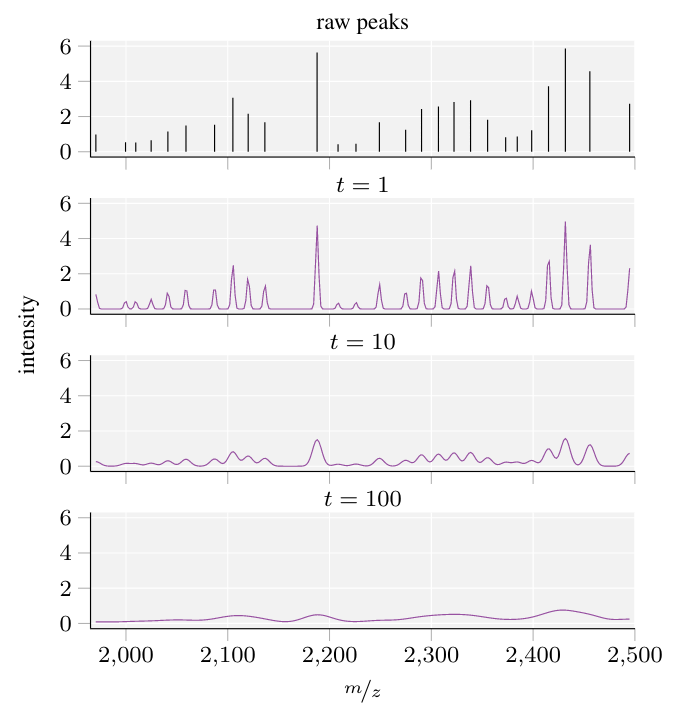

# maldi_PIKE &mdash; Peak Information KErnel for MALDI-TOF MS spectra

`maldi_PIKE` is a small library for Python 3 that include the code used for 
'Topological and kernel-based microbial phenotype prediction from MALDI-TOF mass 
spectra'. The main method includes PIKE, the Peak Information KErnel for MALDI-TOF MS spectra, 
embedded in a Gaussian Process. We developed PIKE based on heat diffusion on structured 
objects. It is well suited for MALDI-TOF mass spectra and able to capture interactions between
mass peaks.

# Dependencies

- Python 3.7
- packages listed in `pyproject.toml`

# Installation

- Clone the repository
- `poetry install`

Follow the instructions given by `poetry`.

# Example behaviour of PIKE

Figure 2:



Code to recreate this graphic in matplotlib.

```python
import ismb2020_maldi
```

This repository is work in progress.
